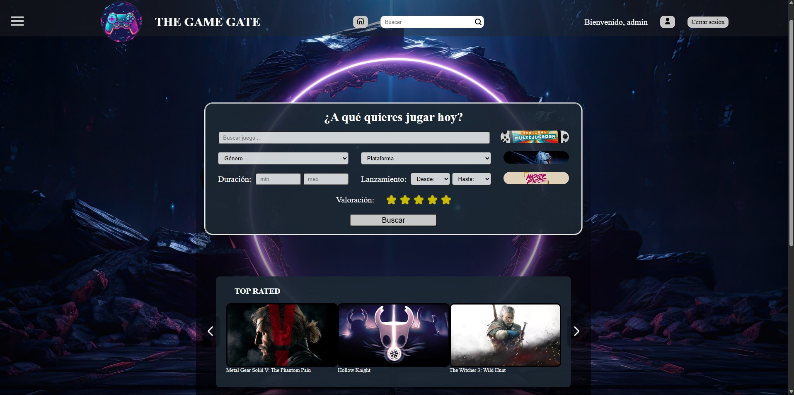
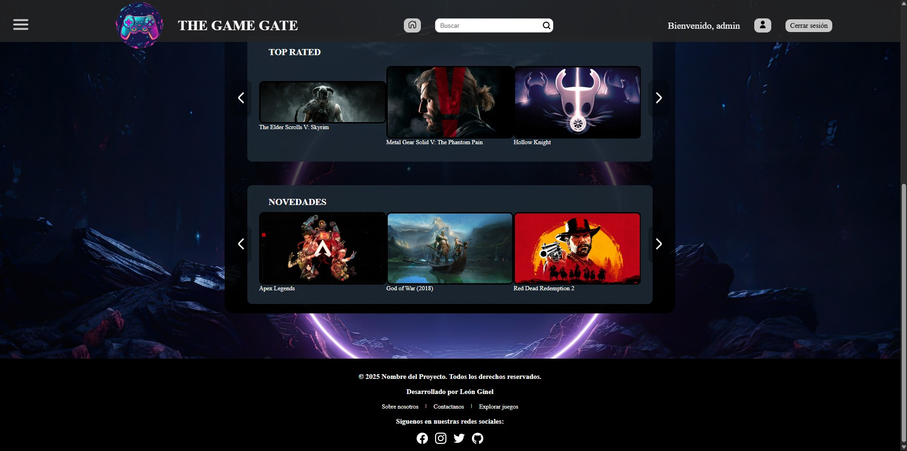
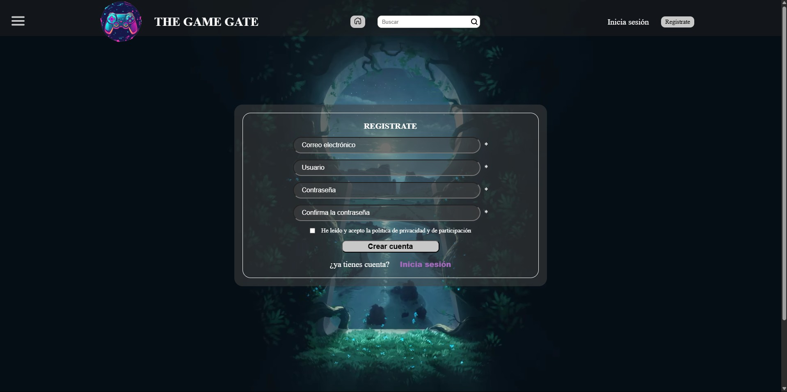
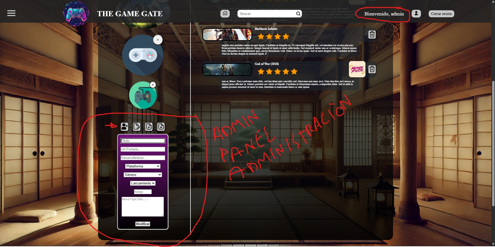
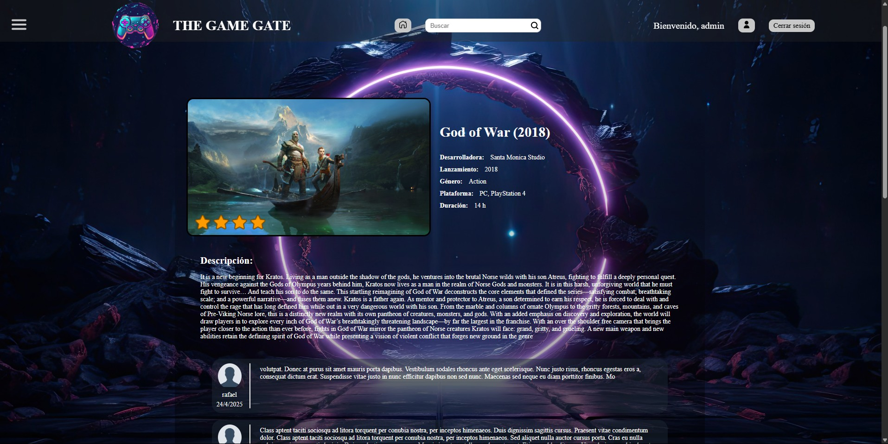
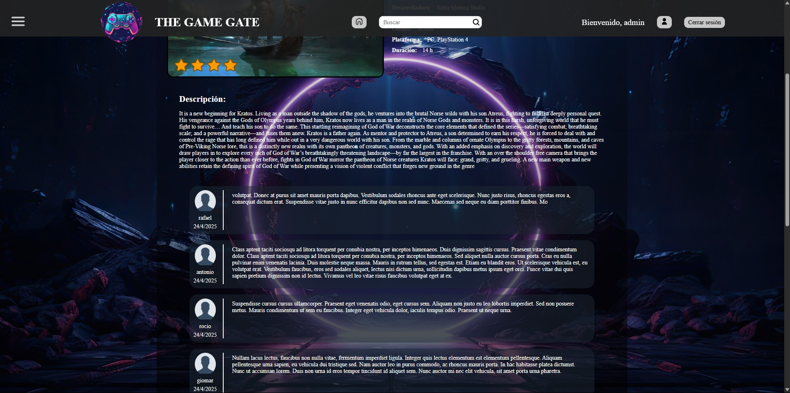

# 🎮 The Game Gate

**The Game Gate** es una plataforma web donde los jugadores pueden descubrir, recomendar y compartir opiniones sobre videojuegos. Su objetivo es ayudar a decidir qué jugar a través de la experiencia colectiva de su comunidad.

---

## ✨ Funcionalidades principales

- 🔍 **Buscador de juegos avanzado** con filtros personalizados.
- 🎯 **Sistema de recomendaciones dinámicas** por categorías y preferencias.
- 👤 **Perfiles de usuario** con funcionalidades como:
  - Top 3 de juegos personalizados
  - Lista de juegos jugados con valoraciones y críticas
- ⭐ **Valoraciones con estrellas**, etiquetas como “Obra maestra” o “Sobrevalorado” y espacio para críticas personales.
- 🧠 **Algoritmo de sugerencias** adaptado al comportamiento y gustos del usuario.
- 🔐 **Registro/Login** con sistema de sesión.
- 📦 Base de datos conectada con la API de RAWG para enriquecer el contenido de los juegos.

---

## 🖼️ Capturas de pantalla

---

## 🚀 Tecnologías usadas

- HTML5, CSS3 y JavaScript (vanilla)
- PHP con arquitectura MVC
- MySQL
- XAMPP (Apache y MySQL)
