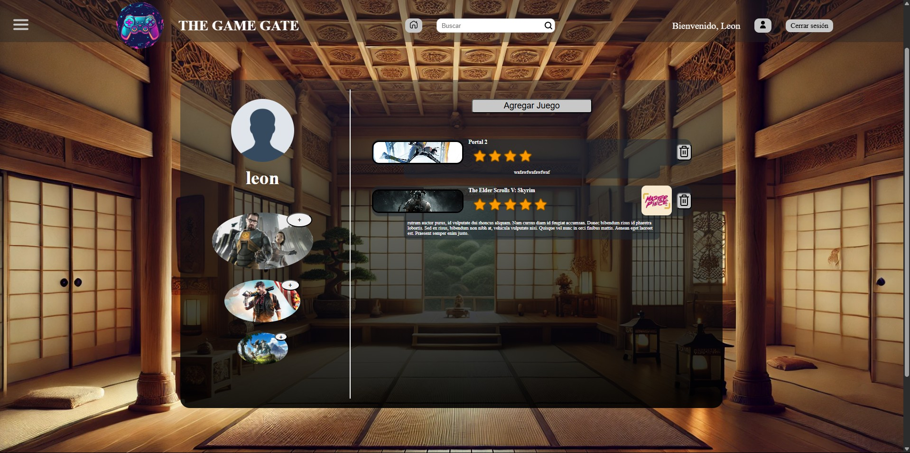

# The Game Gate

**The Game Gate** es una plataforma web para la comunidad gamer que permite descubrir, recomendar y compartir opiniones sobre videojuegos. Su objetivo es ayudar a los usuarios a decidir qué jugar mediante la experiencia colectiva de la comunidad.

---

## Estado y notas importantes

El proyecto está en **desarrollo continuo**, con incorporación de mejoras y nuevas funcionalidades de manera progresiva.  

Futuras mejoras planeadas:  
- Diseño responsive para móviles, tablets y escritorio.  
- Animaciones y transiciones para mejorar la experiencia de usuario.  
- Sistema de “me gusta” en comentarios y opción de descarga de datos.  
- Optimización de búsqueda y filtros en tiempo real.  

---

## Funcionalidades principales

- Buscador avanzado de juegos con filtros y búsqueda en tiempo real.  
- Sistema de recomendaciones adaptado al comportamiento y preferencias del usuario.  
- Perfiles de usuario con Top 3 editable y lista de juegos con valoraciones, críticas y etiquetas (“Obra maestra” / “Sobrevalorado”).  
- Valoración mediante estrellas y espacio para críticas personales.  
- Registro/Login con gestión de sesión.  
- Panel de administración para gestión de usuarios, juegos y contenido.  
- Integración con la API de RAWG para enriquecer la información de los juegos.

---

## Capturas del proyecto

- **Home y navegación principal**  


- **Caruseles y footer**  


- **Registro y login**  


- **Perfil de usuario**  


- **Panel de administración**  


- **Ficha de juego**  


- **Comentarios y valoraciones de usuarios**  


---

## Tecnologías

- **Frontend:** HTML5, CSS3, JavaScript (vanilla)  
- **Backend:** PHP con arquitectura MVC  
- **Base de datos:** MySQL  
- **Servidor local:** XAMPP (Apache y MySQL)  

---

## Objetivos

- Construir una plataforma modular y escalable para recomendación y valoración de videojuegos.  
- Ofrecer una experiencia de usuario intuitiva y dinámica, con interacción en tiempo real.  
- Integrar información externa de juegos mediante la API de RAWG.  
- Demostrar habilidades en desarrollo web completo y buenas prácticas de programación.  

---

## Estructura del proyecto

> Nota: La estructura del proyecto se encuentra en **modificación y evolución** mientras se incorporan nuevas funcionalidades y mejoras.

---

## Instalación

1. Clonar el repositorio:  
```bash
git clone https://github.com/LeonGinel/the-game-gate.git
```
2. Colocar los archivos en el directorio de tu servidor local (XAMPP htdocs).

3. Crear la base de datos MySQL y ejecutar los scripts de creación de tablas.

4. Configurar config.php con los datos de tu base de datos.

5. Abrir index.php en el navegador.

## Autor

**León – Desarrollador Web Fullstack**  

- GitHub: [https://github.com/LeonGinel](https://github.com/LeonGinel)  
- LinkedIn: [https://www.linkedin.com/in/leonginel](https://www.linkedin.com/in/leonginel)
